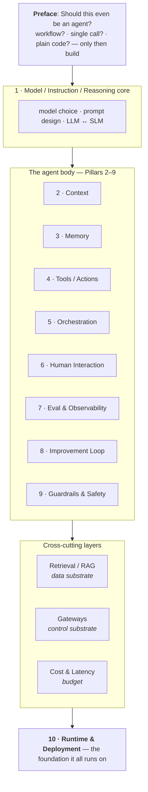

# The Anatomy of an Agent — Architecture Blueprint

A working framework for understanding what to focus on when building an AI agent, and a checklist to walk through every time you architect a new one. This overview ties the parts together; each pillar and layer lives in its own file (linked below).

## What this is and where it comes from

This breaks an agent down into a **preface, ten pillars, and three cross-cutting layers**. The preface asks whether you should build an agent at all; the pillars describe what a good agent *is* and how it *runs*; the cross-cutting layers (Retrieval, Gateways, Cost & Latency) are plumbing several pillars share. It's a synthesis of three bodies of work worth knowing by name:

- **CoALA (Cognitive Architectures for Language Agents)** — the academic model (Princeton, 2023). Organizes agents along information storage, action space, and decision loop.
- **Context engineering** — Anthropic's discipline for managing the full set of tokens at inference time, not just the prompt.
- **12-Factor Agents** (Dex Horthy / HumanLayer) — a production-reliability manifesto.

The core teaching: **an agent is not a prompt. It's a system where the LLM happens to be the planner/executor.** Reliability comes from architecture, not from a better model.

### The principle that ties it together: scaffolding substitutes for intelligence

Every pillar you do well lowers the bar for how smart the core model has to be. A good system prompt is "free intelligence." Good context, memory, tools, and orchestration are "free intelligence." This is why the pillars aren't just quality insurance — they're what lets you slide *down* the model-size curve: do the scaffolding well and a small, fast, fine-tunable, possibly-local model (an SLM) can do the job a frontier LLM would otherwise be needed for. The blueprint makes agents reliable; the same work also makes them cheap and fast.

## The pillar map

The preface gates entry; the Model core sits at the top; the agent-body pillars and the cross-cutting layers (Retrieval, Gateways, Cost & Latency) sit in the middle; and Runtime & Deployment is the foundation everything stands on — a full pillar, but positioned to reflect that the runtime model constrains everything above it.

## Contents

**Before you build**
- [Should this even be an agent?](01-should-this-be-an-agent.md) — the preface / Pillar 0

**Pillars**
1. [Model / Instruction / Reasoning](02-model-reasoning.md) — model choice, prompt design, LLM↔SLM
2. [Context](03-context.md) — engineering the working window
3. [Memory](04-memory.md) — what persists across sessions
4. [Tools / Actions](05-tools-actions.md) — the agent's hands; agent-legible APIs
5. [Orchestration](06-orchestration.md) — the loop, multi-agent, coordination, autonomy
6. [Human Interaction](07-human-interaction.md) — how a person sees, steers, and trusts it
7. [Evaluation & Observability](08-evaluation-observability.md) — seeing and scoring it
8. [Improvement / Learning Loop](09-improvement-loop.md) — how it gets better over time
9. [Guardrails & Safety](10-guardrails-safety.md) — the boundaries
10. [Runtime & Deployment](11-runtime-deployment.md) — how it runs in production *(the foundation)*

**Cross-cutting layers**
- [Retrieval (RAG)](12-retrieval-rag.md) — the data substrate
- [Gateways](13-gateways.md) — the control substrate
- [Cost & Latency](14-cost-latency.md) — the budget constraint

**Reference**
- [Where the buzzwords fit](15-buzzwords-glossary.md) — agentic framework, agent OS, MCP, A2A

## How to use this when architecting a new agent

First run the [preface](01-should-this-be-an-agent.md): if a workflow, single call, or plain code does the job, stop there. If you do need an agent, walk the ten pillars and, for each, ask: **what's my answer, and is it overbuilt or underbuilt for this use case?** Even "not needed" is a valid, deliberate answer.

Decide **Runtime early** despite its number — it's the foundation, and committing to (say) stateless workers with durable execution changes the answers for Memory, Context, Tools, and Orchestration before you build them. Most common mistakes: underbuilding 7–9 (no evals, no improvement loop, no guardrails), and overbuilding 5 (multi-agent when one loop would do). Default to the simplest thing the task's context budget, blast radius, cost target, and runtime allow.

## One-page summary

| # | Pillar | Core question |
|---|--------|---------------|
| 0 | [Should this be an agent?](01-should-this-be-an-agent.md) | Would a workflow / single call / code be better? |
| 1 | [Model / Instruction / Reasoning](02-model-reasoning.md) | Right model (LLM or SLM)? Right-altitude prompt? |
| 2 | [Context](03-context.md) | Smallest high-signal token set? |
| 3 | [Memory](04-memory.md) | What must persist across sessions? |
| 4 | [Tools / Actions](05-tools-actions.md) | Are tools + their APIs agent-legible? |
| 5 | [Orchestration](06-orchestration.md) | Single loop? Continue or stall? Coordination? |
| 6 | [Human Interaction](07-human-interaction.md) | Can a person see, steer, and trust it? |
| 7 | [Evaluation & Observability](08-evaluation-observability.md) | How do I know it's working? |
| 8 | [Improvement Loop](09-improvement-loop.md) | How does it get better over time? |
| 9 | [Guardrails & Safety](10-guardrails-safety.md) | What's the blast radius? |
| 10 | [Runtime & Deployment](11-runtime-deployment.md) | Is state separated from compute? *(decide early)* |
| — | [Retrieval (RAG)](12-retrieval-rag.md) | Cross-cutting *data* layer + its pipeline |
| — | [Gateways](13-gateways.md) | Cross-cutting *control* layer |
| — | [Cost & Latency](14-cost-latency.md) | The budget every pillar trades against |

---
[Next: Should this be an agent? →](01-should-this-be-an-agent.md)
