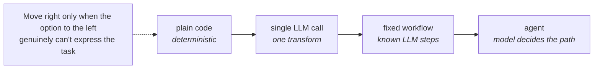

[← Overview](00-overview.md) · Agent Architecture Blueprint

# Preface (Pillar 0) — Should this even be an agent?

**What it is:** The question to answer *before* any other pillar. The blueprint helps you build an agent well — but the highest-leverage decision is often not to build one.

**The teaching:** The most reliable systems use the simplest thing that works. There's a spectrum, and you should move right only when the option to the left genuinely can't express the task:

An agent earns its complexity only when **all** of these hold: the steps aren't fully knowable in advance, the system needs to decide what to do next at runtime, there's a clear success signal and a feedback loop to self-correct, and the task genuinely benefits from both reasoning and action. If the steps are known, build a workflow. If it's a single transform, make one LLM call. If it's deterministic, write code. A workflow is more predictable and cheaper than an agent for any task it can express.

**Simple vs. complex:**
- *Not an agent:* fixed pipelines, classification, extraction, single-shot generation — workflow or code.
- *Agent:* open-ended tasks where the path varies per input and the system must choose tools/steps dynamically.

**Architect's checklist:**
- [ ] Are the steps knowable in advance? (If yes → workflow, not an agent.)
- [ ] Does the system need to decide *what to do next* at runtime based on intermediate results?
- [ ] Is there a clear success signal and a feedback loop to self-correct?
- [ ] Could a fixed workflow with one or two LLM steps cover 80% of this?
- [ ] What's the cost of the agent being wrong vs. the value of its autonomy?

**Failure mode:** Building an agent because it's exciting, and shipping something less reliable and more expensive than a script would have been — "agentic" theater. The best agent is sometimes the one you didn't build.

---
[← Overview](00-overview.md) · [Next: Model / Instruction / Reasoning →](02-model-reasoning.md)
